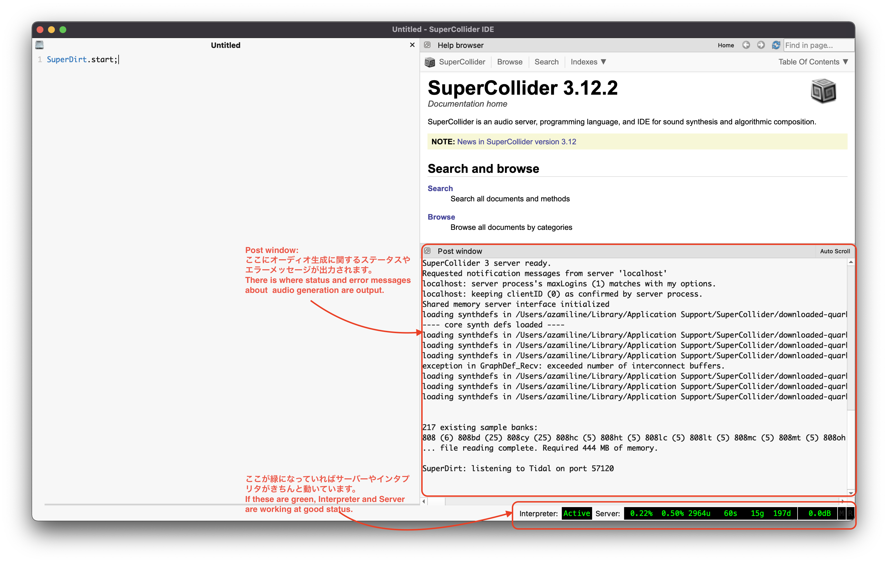
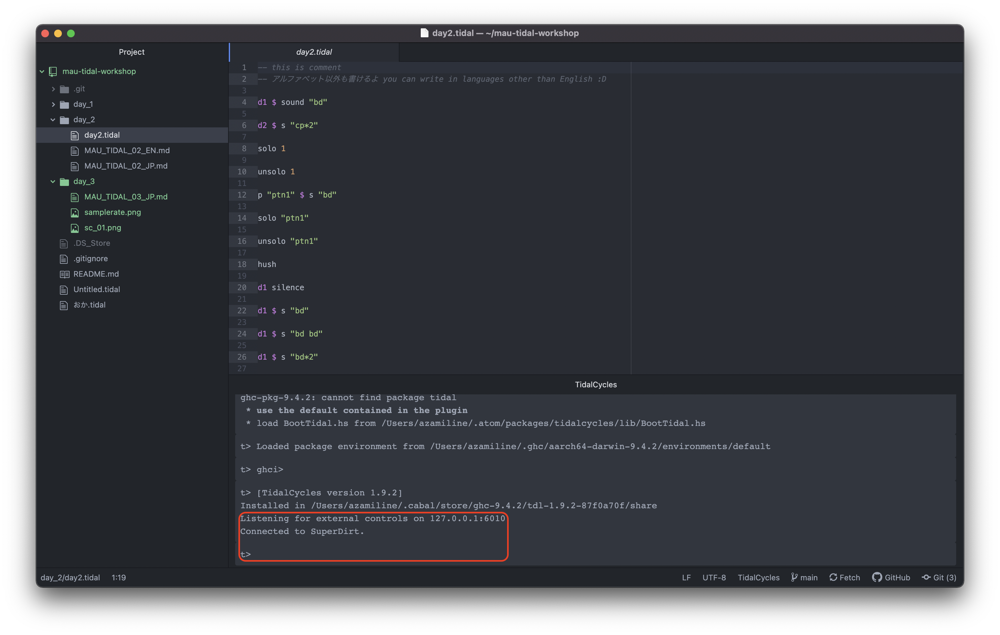
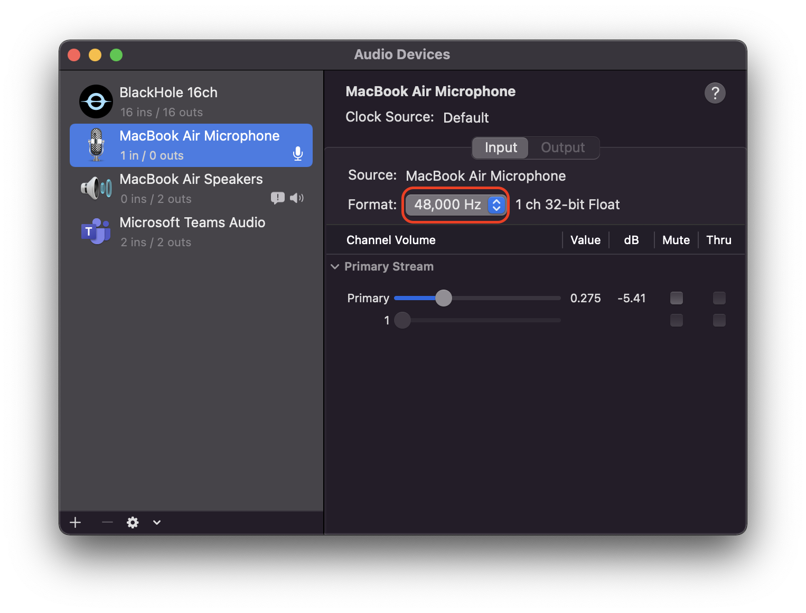
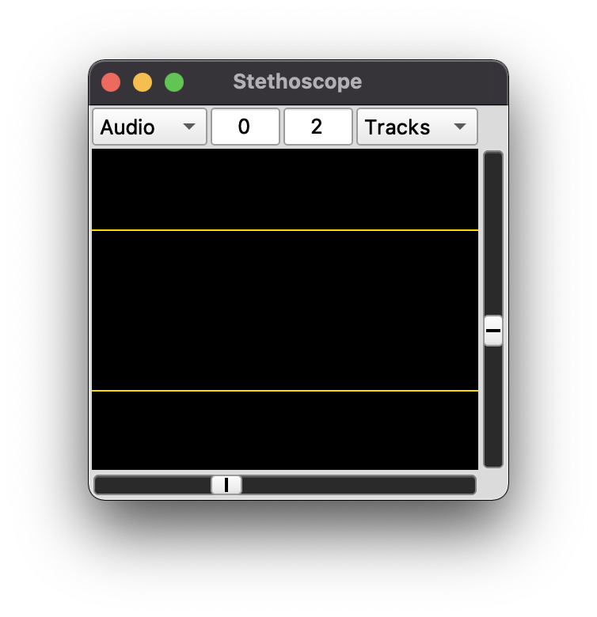
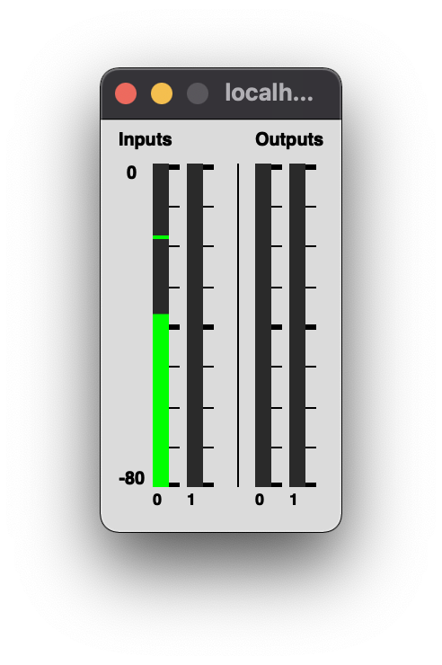
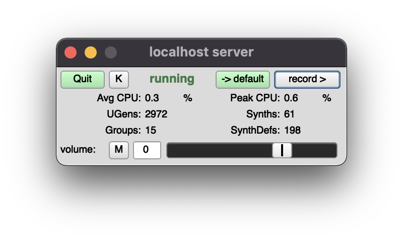

# DAY3｜Continuation of the tutorial

### How to start up

1. Start the SuperCollider app, type `SuperDirt.start;` and run it with `command + enter` or `ctrl + enter`. When the message `SuperDirt: listening to Tidal on port 57120` appears in the Post Window in the lower right corner, it's good status!


2. Open the text editor Atom, open a new document with `command + N` or `ctrl + N`, and save it anywhere you like with `command + S` or `ctrl + S` with any name you like. But when you name the file, make sure the extension is `tidal`, like `name as you like.tidal`.

3. Select "Packages" → "Boot TidalCycles" from the menu bar. A window will appear in the editor with the message `Listening for external controls on 127.0.0.1:6010
t> Connected to SuperDirt.
When you see `. Let's play some patterns!


***

### Troubleshooting

#### When the following error message appears when starting SuperCollider and it cannot be started
```
ERROR: Input sample rate is 44100, but output is 48000. Mismatched sample rates are not supported. To disable input, set the number of input channels to 0.
could not initialize audio.
RESULT = 0
```

1. open the "Audio Midi Settings" application ("Others" → "Audio Midi Settings" on Launchpad)
2. Set the currently selected audio device to **same sampling rate** for both input and output. (Check the currently selected audio device in "System Preferences"->"Sound")

- There is also a way to set it up on SuperCollider, but we skip it here.

***

### Tutorial Material
Download from [here](https://drive.google.com/file/d/1ERd3_c67nds792rQ5bpczYyUlLk7KQxk/view?usp=sharing).

***

### Items that are useful to put out on the SuperCollider side

#### Frequency Scope
```
s.scope;
```


#### Gain Meter
```
s.meter;
```



#### Convenient GUI including record buttons
```
s.makeGui;
```

