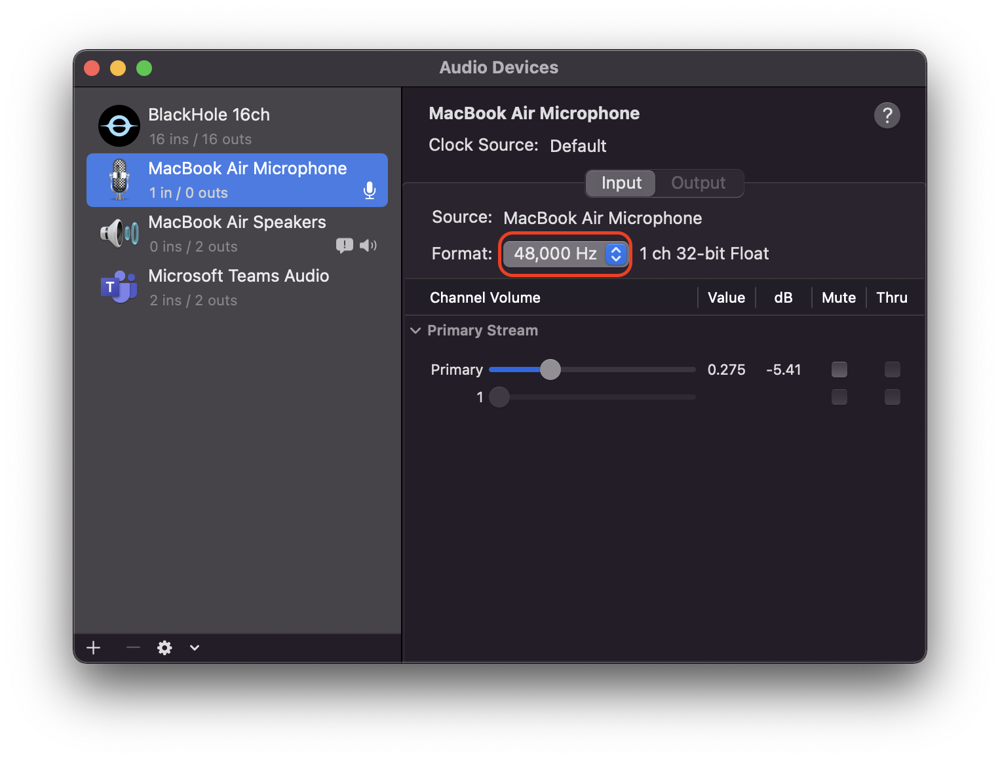
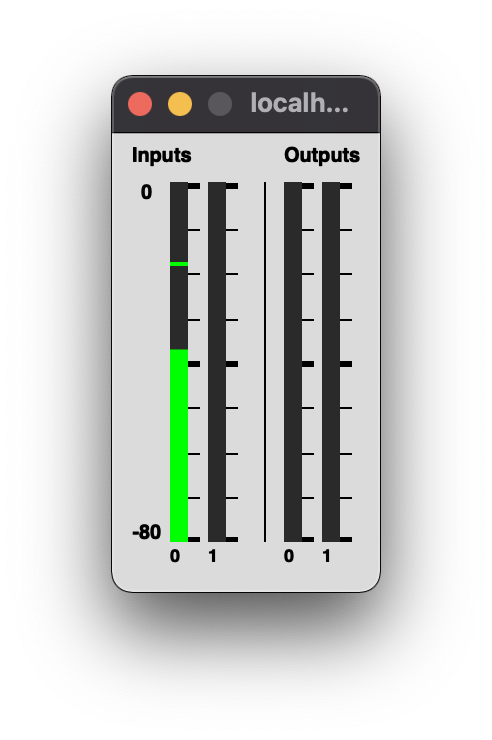
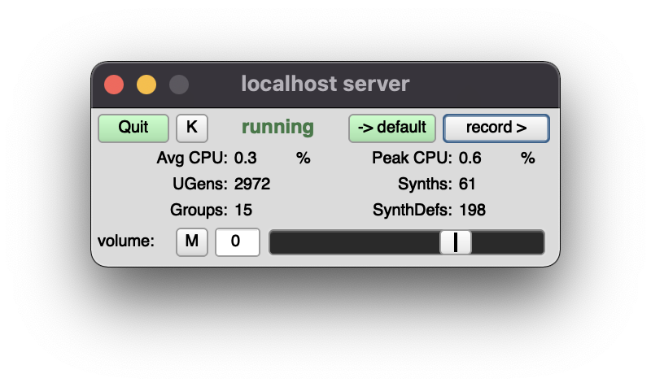

# DAY3｜チュートリアルの続き

### 起動の方法（おさらい）

1. SuperColliderアプリを起動して、`SuperDirt.start;`と入力し、`command + enter`または`ctrl + enter`で実行します。右下のPost Windowに`SuperDirt: listening to Tidal on port 57120`とメッセージが出たらOK。


2. テキストエディタAtomを開いて、`command + N`または`ctrl + N`で新しいドキュメントを開き、`command + S`または`ctrl + S`で好きなところに好きな名前で保存してください。しかしファイルに名前をつけるときは、`好きな名前.tidal`のように、拡張子を`tidal`にしましょう。

3. メニューバーの"Packages" → "Boot TidalCycles"を選択。エディタ内に立ち上がったウィンドウに`Listening for external controls on 127.0.0.1:6010
t> Connected to SuperDirt.
`と表示されたら準備OKです。


***

### トラブルシューティング

#### SuperCollider起動時、以下のようなエラーメッセージが出てしまって起動ができないとき
```
ERROR: Input sample rate is 44100, but output is 48000. Mismatched sample rates are not supported. To disable input, set the number of input channels to 0.
could not initialize audio.
RESULT = 0
```

1. "Audio Midi 設定"アプリ（Launchpadだと、"その他"→"Audio Midi 設定""）を開く
2. 現在選択中のオーディオデバイスを入力・出力ともに**同じサンプリングレート**に設定する。（現在選択中のオーディオデバイスは、"システム環境設定"→"サウンド"から確認しましょう。）

- SuperCollider上で設定する方法もありますが、ここでは省略します。

***

### チュートリアル
ダウンロードは[ここから](https://drive.google.com/file/d/1ERd3_c67nds792rQ5bpczYyUlLk7KQxk/view?usp=sharing)どうぞ。

***

### SuperCollider側で出しておくと便利なもの

#### フリクエンシースコープ
```
s.scope;
```


#### メーター
```
s.meter;
```



#### レコードボタンを含む便利なGUI
```
s.makeGui;
```

