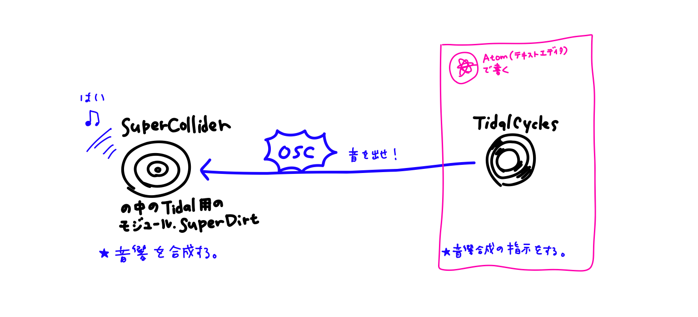
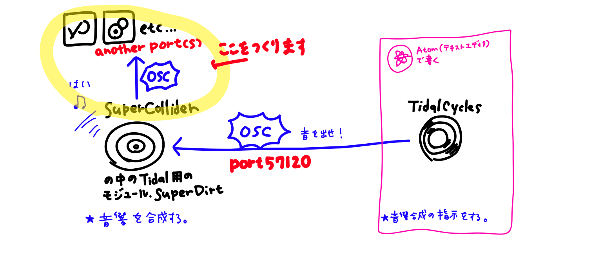
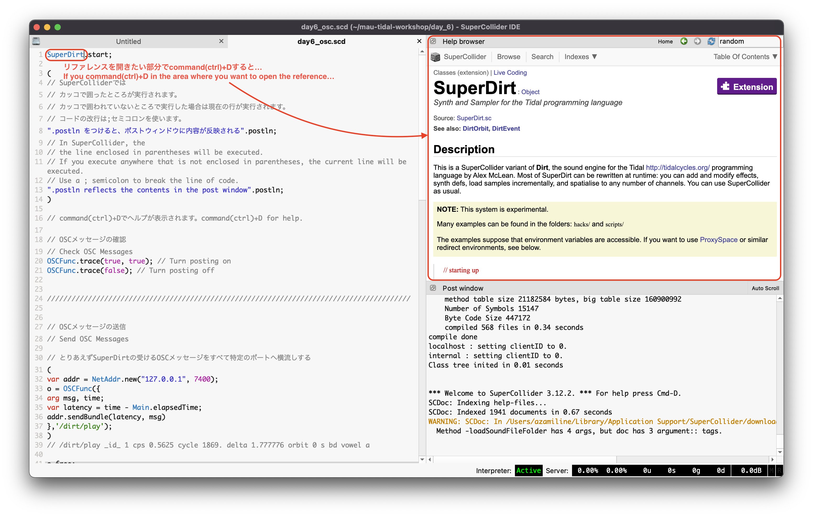
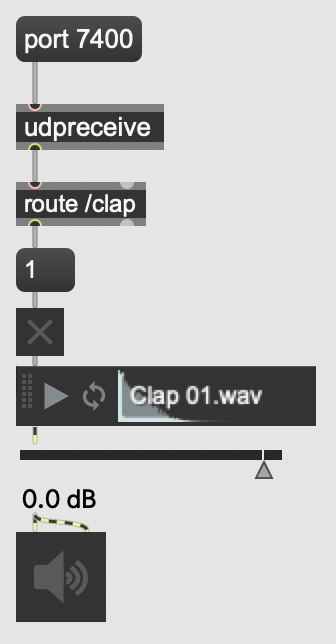
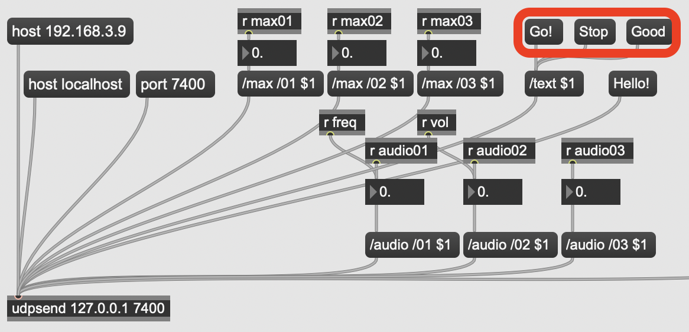
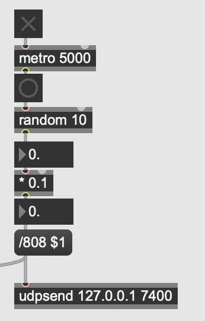
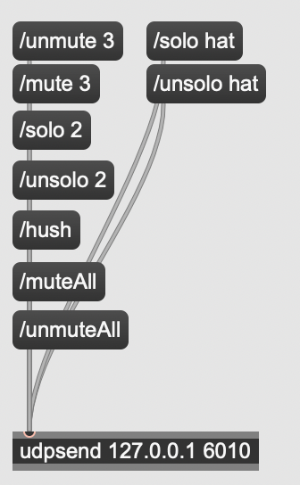

# DAY6｜OSC Communication

Let's try to use the **OSC (Open Sound Control)** protocol, which we started using in Max and Processing this week, in TidalCycles as well.

[Download today's pack of sample code here.](https://drive.google.com/file/d/1bksmVh4XFJDo4Mi7Pwq4WZ60sXn0j0xu/view?usp=sharing)

### TidalCycles runs on OSC communication

<br>

TidalCycles provides the instructions for sound synthesis via OSC, and SuperCollider receives the OSC and synthesizes the sound.

<br>

Tidal and SuperCollider are communicating on port 57120, and I'll first try to channel all these OSC messages across to another port!<br>
-> Now let's explore the SuperCollider side a little more.

### SuperCollider operation minimal explanation

- Execution is `command(ctrl)`+`enter`!
- In SuperCollider, the place enclosed by parentheses is executed.
- If you execute at a point not enclosed in parentheses, the current line is executed.
- A `;` semicolon is used to break lines of code.
- You can comment out lines with `command(ctrl)`+`/`. Lines with `//` at the beginning are treated as comments.

```
(
".postln to reflect the content in the post window".postln;
)
```
- `command(ctrl)`+`D` for help.
<br>

## Send from TidalCylces(SuperCollider)

### Check the OSC messages that SuperDirt is receiving

In SuperCollider side, execute
```
OSCFunc.trace(true, true); // Turn posting on
```
and if you try the following sounds on Tidal:
```
d1 $ s "bd"
```
the following message is output to the SuperCollider post window.
```
OSC Message Received:
	time: 18296.001604264
	address: a NetAddr(127.0.0.1, 6010)
	recvPort: 57120
	msg: [ /dirt/play, _id_, 1, cps, 0.56999999284744, cycle, 9673.0, delta, 1.7543840408325, orbit, 0, s, bd ]
```
This triggers the SuperDirt to generate sound.<br>

To turn off OSC message posting:
```
OSCFunc.trace(false);
```
### Channeling all incoming SuperDirt OSC messages across to another port
Let's send the contents of the `/dirt/play` message received to port 9000 as is. Execute the following with SuperCollider.
```
(
var addr = NetAddr.new("127.0.0.1", 9000);
o = OSCFunc({
arg msg, time;
var latency = time - Main.elapsedTime;
addr.sendBundle(latency, msg)
},'/dirt/play');
)
```
Open the sketch `a00_receive.pde` to see how the visuals and sounds are linked. The Processing sketches from here on include [Alex McLean's sketch](https://github.com/yaxu/p5dirt) and [Atsushi Tadokoro's](https://yoppa.org/mit-sound20/11875.html) References. [(cc)](https://creativecommons.org/licenses/by/4.0/)
- `a01_changeBg.pde`: A sketch that randomly change background color to match the sound.
- `a02_drawCircle.pde`: A sketch in which color-coded circles appear according to the sound and orbit(d1~d6).
- `a03_drawBar.pde`: A sketch with horizontal colored lines appearing in time with the sound and orbit.
- `a04_drawCycle.pde`: A sketch of the sequence of "a03" going from left to right in the style of an LED.<br>

On the Processing side, you can see that the number of `orbit`s is extracted from the received message and used.
```
void oscEvent(OscMessage m) {
  int orbit = -1;
  float cycle = -1;
  for (int i = 0; i < m.typetag().length(); i++) {
    String name = m.get(i).stringValue();
    switch(name) {
    case "orbit":
      orbit = m.get(i+1).intValue();
      break;
    case "cycle":
      cycle = m.get(i+1).floatValue();
      break;
    }
    i++;
  }
  if (orbit >= 0) {
    notes.add(new Note(orbit, cycle));
  }
}
```
In any case, all you have to do is pick out the message you want to use from the following messages that SuperDirt is receiving!
```
/dirt/play, _id_, 1, cps, 0.56999999284744, cycle, 9673.0, delta, 1.7543840408325, orbit, 0, s, bd ]
```

### ★ Send a message to a specific port only when playing a sound named `sine` in Tidal

- Send: SuperCollider
```
(
var addr = NetAddr.new("127.0.0.1", 7400); // port 7400
o = OSCFunc({
arg msg, time;
var latency = time - Main.elapsedTime;
var event = (), orbit;
	for (0, msg.size,
		{
		arg i;
		if (msg[i].asString == "sine")
			{
				"a selected file sounded.".postln;
				addr.sendMsg("/clap");
	        }
	     }
	);
},'/dirt/play');
)
```
- Receive: Max

  

## Receive OSC on TidalCylces(SuperCollider)


### Confirmation of OSC reception
First, open the port to receive.

- SuperCollider
```
thisProcess.openUDPPort(7400); // open port 7400 - 7400番のポートを開ける
thisProcess.openPorts; // list all open ports - 開いているポートのリストを表示
```

When you are ready to check the message received by SuperCollider, try sending a `/text` message from Max.

- Receive: SuperCollider
```
o = OSCFunc({ arg msg, time, addr, recvPort; [msg, time, addr, recvPort].postln; }, '/text');
```

- Send: Max

  


### ★ If the `/text` message is `Good`, then the 808 sample will be played.

- Receive: SuperCollider

  ```
  (
  o = OSCFunc(

  	{
  		arg msg;
  		msg[1].postln;
  		if (msg[1].asString == "Good", {
  			(type: \dirt, dirt: ~dirt, s: \808, speed: -1, gain: 2).play;
  			"gong".postln;
  		})
  	}
  	, '/text'

  );
  )
  ```

  By the way, this part `(type: \dirt, dirt: ~dirt, s: \808, speed: -1, gain: 2).play;` is the code to sound the SuperDirt sample using only SuperCollider.

### ★ When `/808` message is received, 808 samples are played at the playback speed specified by OSC

- Receive: SuperCollider

  ```
  (
  o = OSCFunc(

  	{
  		arg msg;
  		(type: \dirt, dirt: ~dirt, s: \808, speed: msg[1].asFloat,
  		 gain: 2, n: [0,5,10].rand).play;
  	}
  	, '/808'

  );
  )
  ```
- Send: Max

  

### ★ Use port 6010 on the SuperCollider (SuperDirt) side

You can control the playback by sending it to port `6010` on the SuperCollider (SuperDirt) side. No special preparation is required on the SuperCollider side.
- `/mute 1`, `/unmute 1`: mute and unmute `d1` in TidalCycles.
- `/solo 1`, `/unsolo 1`: allows you to solo and un-solo `d1` in TidalCycles.
- `/solo hat`, `/unsolo hat`: allows you to solo or unsolo `p "hat"`. So does `mute`.
- `/muteAll`, `/unmuteAll`: mute and unmute all connections in TidalCylces.
- `/hush`: allows you to stop all sound in TidalCycles.


- Max<br>

  
