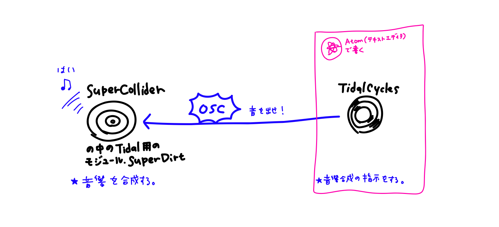

# DAY6｜OSC通信

今週MaxやProcessingでも利用を始めた**OSC(Open Sound Control)**というプロトコルをTidalCyclesでも使ってみましょう。

[今日のサンプルコードのパックはここからダウンロードしてください。](https://drive.google.com/file/d/1bksmVh4XFJDo4Mi7Pwq4WZ60sXn0j0xu/view?usp=sharing)

### そもそもTidalCyclesはOSC通信で動いています

<br>

TidalCyclesが音響合成の指示を行って、その指示がOSCで送られ、SuperColliderがOSCを受信して音響を合成しているという仕組みです。

<br>

TidalとSuperColliderはport 57120で通信していて、まずこのOSCメッセージをすべて別のポートへ横流ししてみます！<br>
→ ここで少しSuperCollider側を操作していってみましょう。

### SuperColliderの操作ミニマル説明

- 実行は`command(ctrl)`+`enter`でしたね！
- SuperColliderではカッコで囲ったところが実行されます。
- カッコで囲われていないところで実行した場合は現在の行が実行されます。
- コードの改行は`;`セミコロンを使います。
- コメントアウトはAtomと同じ`command(ctrl)`+`/`で行えます。頭に`//`がある行はコメント扱い。

```
(
".postln をつけると、ポストウィンドウに内容が反映される".postln;
)
```
- `command(ctrl)`+`D`でヘルプが表示されます。
<br>

## TidalCylces(SuperCollider)から送信

### SuperDirtが受信しているOSCメッセージを見てみる

SuperCollider側で
```
OSCFunc.trace(true, true); // Turn posting on
```
を実行し、Tidalで
```
d1 $ s "bd"
```
という音を出してみると、
```
OSC Message Received:
	time: 18296.001604264
	address: a NetAddr(127.0.0.1, 6010)
	recvPort: 57120
	msg: [ /dirt/play, _id_, 1, cps, 0.56999999284744, cycle, 9673.0, delta, 1.7543840408325, orbit, 0, s, bd ]
```
以上のようなメッセージがSuperColliderのポストウィンドウに出力されます。これが、SuperDirtが音を出すためのトリガーになっています。<br>

OSCメッセージのポスティングをオフにするには
```
OSCFunc.trace(false); // Turn posting off
```
### SuperDirtが受信しているOSCメッセージを別のポートへすべて横流しする
受け取った`/dirt/play`メッセージの中身をポート9000番へそのまま送ってみます。以下をSuperColliderで実行します。
```
(
var addr = NetAddr.new("127.0.0.1", 9000);
o = OSCFunc({
arg msg, time;
var latency = time - Main.elapsedTime;
addr.sendBundle(latency, msg)
},'/dirt/play');
)
```
試しにスケッチ`a00_receive.pde`を開いて、ビジュアルと音が連動している様子をみてみましょう。ここからのProcessingスケッチは[Alex McLeanさんのスケッチ](https://github.com/yaxu/p5dirt)含む、[田所淳先生のもの](https://yoppa.org/mit-sound20/11875.html)を参照しています。[(cc)](https://creativecommons.org/licenses/by/4.0/)
- `a01_changeBg.pde`: 音に合わせてランダムに背景色が変わるスケッチ。
- `a02_drawCircle.pde`: 音とorbit(d1~d6)に合わせて色分けされた円が現れるスケッチ。
- `a03_drawBar.pde`: 音とorbitに合わせて横長の色付きラインが現れるスケッチ。
- `a04_drawCycle.pde`: "a03"が左から右に進むシーケンスのLED風になったスケッチ。<br>

Processing側では受け取ったメッセージの中から`orbit`の数を抜き出して利用していることがわかります。
```
void oscEvent(OscMessage m) {
  int orbit = -1;
  float cycle = -1;
  for (int i = 0; i < m.typetag().length(); i++) {
    String name = m.get(i).stringValue();
    switch(name) {
    case "orbit":
      orbit = m.get(i+1).intValue();
      break;
    case "cycle":
      cycle = m.get(i+1).floatValue();
      break;
    }
    i++;
  }
  if (orbit >= 0) {
    notes.add(new Note(orbit, cycle));
  }
}
```
つまりSuperDirtの受けている以下のようなメッセージの中から使いたいメッセージを選び出していけばよい！
```
/dirt/play, _id_, 1, cps, 0.56999999284744, cycle, 9673.0, delta, 1.7543840408325, orbit, 0, s, bd ]
```

### ★ Tidalで`sine`という名前のサウンドを鳴らすときだけ特定のポートへメッセージを送る

- Send: SuperCollider
```
(
var addr = NetAddr.new("127.0.0.1", 7400); // port 7400
o = OSCFunc({
arg msg, time;
var latency = time - Main.elapsedTime;
var event = (), orbit;
	for (0, msg.size,
		{
		arg i;
		if (msg[i].asString == "sine")
			{
				"a selected file sounded.".postln;
				addr.sendMsg("/clap");
	        }
	     }
	);
},'/dirt/play');
)
```
- Receive: Max

  

## TidalCylces(SuperCollider)が受信


### OSC受信できるか確認
まず受信するポートを開放します。

- SuperCollider
```
thisProcess.openUDPPort(7400); // open port 7400 - 7400番のポートを開ける
thisProcess.openPorts; // list all open ports - 開いているポートのリストを表示
```

SuperColliderで受信したメッセージを確認する準備ができたら、Maxから`/text`メッセージを送信してみる。

- Receive: SuperCollider
```
o = OSCFunc({ arg msg, time, addr, recvPort; [msg, time, addr, recvPort].postln; }, '/text');
```

- Send: Max

  


### ★ `/text`メッセージの中身が"Good"だったら808のサンプルを鳴らす

- Receive: SuperCollider

  ```
  (
  o = OSCFunc(

  	{
  		arg msg;
  		msg[1].postln;
  		if (msg[1].asString == "Good", {
  			(type: \dirt, dirt: ~dirt, s: \808, speed: -1, gain: 2).play;
  			"gong".postln;
  		})
  	}
  	, '/text'

  );
  )
  ```

  ちなみに、この部分`(type: \dirt, dirt: ~dirt, s: \808, speed: -1, gain: 2).play;`はSuperColliderだけでSuperDirtのサンプルを鳴らすコードです。

### ★ `/808`メッセージを受信したら、808サンプルをOSCで指定された再生速度で鳴らす

- Receive: SuperCollider

  ```
  (
  o = OSCFunc(

  	{
  		arg msg;
  		(type: \dirt, dirt: ~dirt, s: \808, speed: msg[1].asFloat,
  		 gain: 2, n: [0,5,10].rand).play;
  	}
  	, '/808'

  );
  )
  ```
- Send: Max

  

### ★ SuperCollider(SuperDirt)側のポート6010を使う

SuperCollider(SuperDirt)側のポート`6010`に送るとプレイバックのコントロールが可能です。特にSuperCollider側で準備をする必要はなし。
- `/mute 1`, `/unmute 1`: TidalCyclesでの`d1`をミュートしたりミュート解除したりできます。
- `/solo 1`, `/unsolo 1`: TidalCyclesでの`d1`をソロ状態にしたりソロ状態の解除をしたりできます。
- `/solo hat`, `/unsolo hat`: `p "hat"`をソロ状態にしたりソロ状態を解除したりできます。`mute`も然り。
- `/muteAll`, `/unmuteAll`: TidalCylcesでのすべてのコネクションをミュートしたりミュート解除したりできます。
- `/hush`: TidalCyclesの音をすべて止めることができます。


- Max<br>

  
