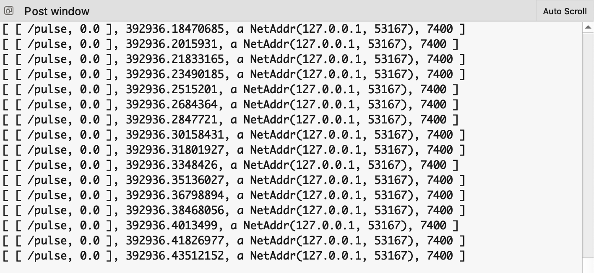

# TidalCycles(SuperCollider)とTouchDesigner間のOSC通信

## TidalCyclesからTouchDesignerへ

### シンプルな方法

基本的にDay6で行った方法と同じです。

#### SuperCollider側
```
// とりあえずSuperDirtの受けるOSCメッセージをすべて特定のポートへ横流しする

(
var addr = NetAddr.new("127.0.0.1", 9000); // 相手のIPアドレスと送信するポート
o = OSCFunc({
  arg msg, time;
  var latency = time - Main.elapsedTime;
  addr.sendBundle(latency, msg);
  msg.postln; // どのようなメッセージが送られているかpost windowで確認
  },'/dirt/play');
)
```

💡 TidalCyclesで`range`などを使って徐々に変化する数値を扱うと、ビジュアル側がその数値を扱いやすいかもしれません。

#### TouchDesigner側
CHOP`OSC In`の`Network Port`の数字を合わせると、以下のように自動的にメッセージがパースされます。


取り出したいチャンネル名をCHOP`Select`で選択すると、自分のビジュアルのモジュレーションに使うなどできます。


### メッセージ内の特定の数値だけをやりとりする方法

#### SuperCollider側

以下は"sine"という名前のサウンドを鳴らすときに特定のポートへ音量の数値を送信する例です。SuperCollider側でfor文、if文を使ってTidalCyclesが送信しているOSCメッセージから、欲しい情報を抜き取ります。以下をテンプレートとして、書き替えて使ってみてください。
```
(
var addr = NetAddr.new("127.0.0.1", 9000); // 相手のIPアドレスと送信するポート
o = OSCFunc({
arg msg, time;
var gain = -1;
for (0, msg.size,
	{
	arg i;
	if (msg[i].asString == "sine")
		{
			for (0, msg.size,
				{
					arg i;
				if (msg[i].asString == "gain")
				{
					gain = msg[i+1].asFloat;
					gain.postln;
					addr.sendMsg("/touch", gain);
				}}
			)
        }
     }
);
},'/dirt/play');
)
```
#### TouchDesigner側
CHOP`OSC In`の`Network Port`の数字を合わせるだけ。


***

## TouchDesignerからTidalCyclesへ

💡 まず必ず相手側とやりとりするポートを決めて、そのポートを開けましょう。

```
// SuperCollider

thisProcess.openUDPPort(7400); // open port 7400 - 7400番のポートを開ける
thisProcess.openPorts; // list all open ports - 開いているポートのリストを表示
```

### CHOPだけを使う方法①

#### TouchDesigner側

例えば、定期的に値`1`を送出するCHOP`Beat`の`Pulse`をCHOP`OSC Out`につないでみます。また、CHOP`Rename`を挟めば、任意のチャンネル名を設定できます。


`rename1`の中身<br>


#### SuperCollider側

TouchDesignerのCHOP`OSC Out`は、連続してメッセージを送信し続けます。試しにどのようにメッセージが届いているか見てみましょう。

```
// 受信しているOSCメッセージを確認する

o = OSCFunc({ arg msg, time, addr, recvPort; [msg, time, addr, recvPort].postln; }, '/pulse');
```

連続したメッセージがすごい速さで受信されていることがわかります。


```
// OSCメッセージの確認を終わる

o.free;
```
つまり、連続した値が1.0になったときだけ発音する、といったようなコードを書かないとずっと音がトリガーされつづけることになります。<br>
CHOP"beat"のパルスが1.0になったときだけSuperCollider側で何かするには以下のように書くとよいです。

```
(
o = OSCFunc(

	{
		arg msg;
		var num1;
		num1 = msg[1];
		if (num1.asFloat == 1.0, {
			msg.postln; // msgの内容を出力
			(type: \dirt, dirt: ~dirt, s: \808, speed: 1.25, gain: 2).play; // サンプルを鳴らす
		})
	}
	, '/pulse'

);
)
```

### CHOPだけを使う方法②

#### TouchDesigner側
例えばCHOP`LFO`を使った値をSuperCollider側で扱うには？


#### SuperCollider側の例①

CHOP"LFO"の値が小数点以下第3位まで丸めると0.999になったときだけSuperCollider側でサンプルを鳴らす例
```
(
o = OSCFunc(

	{
		arg msg;
		var num1;
		num1 = round(msg[1].asFloat, 0.001); // CHOP"LFO"の値が小数点以下第3位まで丸める
		if (num1 == 0.999, { // 丸めた数字が0.999と等しい場合、
			msg.postln; // msgの内容を出力する。
			(type: \dirt, dirt: ~dirt, s: \808, speed: 0.75, gain: 2).play; // サンプルを鳴らす。
		})
	}
	, '/chan1'

);
)
```

#### SuperCollider側の例②
TidalCyclesは連続した値を使いづらいのですが、SuperColliderのシンセサイザーは扱いやすいです。興味があれば、SuperColliderの[`Ndef`](https://doc.sccode.org/Classes/Ndef.html)などを利用して演奏するのもありかもしれません。<br>

まずサインウェーブを生成します。
```
(
Ndef(\a, {
	arg freq = 0.1;
	SinOsc.ar([freq * 440, freq * 444], 0 , 0.06)
}
).play;
)

Ndef(\a).gui; // GUIを表示
Ndef(\a).clear; // \aというシンセを消す
```
OSCでTouchDesignerのLFOの値を受信しシンセへ代入します。
```
(
o = OSCFunc(

	{
		arg msg;
		var freq = 0.1;
		freq = msg[1].asFloat.abs; // .abs 絶対値をとる
		Ndef(\a).set(\freq, freq);
	}
	, '/chan1'

);
)
```
### DATを使う方法
TouchDesigner側でDATを扱うと、Maxの`Bang`のように、一度だけメッセージを送出することができたり、もう少しメッセージ内容を柔軟に扱いやすくなったりします。日本語ドキュメントだと[このページ](http://satoruhiga.com/TDWS2018/day14/)がわかりやすいので、詳しく知りたい人は見てみると、基本的な仕組みや操作方法などが学べます。

#### TouchDesigner側 基本例
Tabキーを押すと出てくるメニューからDATタブを開くと、`OSC Out` DATが見つかります。


IPアドレスとポートを指定します。


Tabキー > DATタブ > Text DATを開いて、`Text` DATの中にPythonプログラムを書きます。編集可能状態にするには、Text DATの箱の一番右下端のマークをクリックします。もう一度クリックすると編集可能状態は解除されます。


`Text`内に書くPythonプログラム
```
OSC = op('oscout2') // OSC Out DATの名前と合わせる。
OSC.sendOSC('/hey', [0.0]) // OSCメッセージの内容を自由に書く。
```

Text DATの編集可能状態を解除した状態で（オブジェクトがピンク色になっている状態）右クリック > `Run Script`、または`Command / Ctrl` + `r`で指定したOSCメッセージ(`/hey, 0.0`)が指定したポートへ送出されます。

#### SuperCollider側

```
// "/hey"というメッセージが来たら
(
o = OSCFunc(

	{
		arg msg;
		(type: \dirt, dirt: ~dirt, s: \808, speed: 1.25, gain: 2).play; // サンプルを鳴らす
	}
	, '/hey'

);
)
```

#### TouchDesigner側 応用例

`CHOP Execute`を使うと、CHOPと連携して自動的に`Run Script`することができます。


`Text` DATと同じように右下のボタンを使って編集状態と読み取り状態を遷移します。`onValueChange`関数の中に書いたプログラムが、指定されたCHOPの値が変わったときに実行されます。


以下のように、`CHOP Execute` DATのプロパティ内からCHOPの指定を行います。


`CHOP Execute`に書いてみたPythonプログラム
```
import random # ランダムを使えるようにライブラリをインポートする

def onValueChange(channel, sampleIndex, val, prev):
	OSC = op('oscout2') # OSC Out DATの名前を指定
	num = random.uniform(-1.0, 2.5) # -1.0から2.5までの範囲でランダムな数字を生成
	OSC.sendOSC('/hey', [num]) # /heyメッセージにランダムな数字を含めてOSC送出
	return
```
連携するCHOPはこんなふうにしてみました。

1. `beat1` - 一定のテンポで数値が変わるので、そのたびにOSCを送出する。

2. `lfo2` - `math1`で小数点以下を丸めると、値が`-1`、`0`、`1`の3段階に変化する。そのたびにOSCを送出する。

#### SuperCollider側
"/hey"というメッセージが来たらメッセージ内の2番目に送られてくる数字をサンプル再生speedに代入する。
```
(
o = OSCFunc(

	{
		arg msg;
		(type: \dirt, dirt: ~dirt, s: \808, speed: msg[1].asFloat, gain: 2).play;
	}
	, '/hey'

);
)
```
